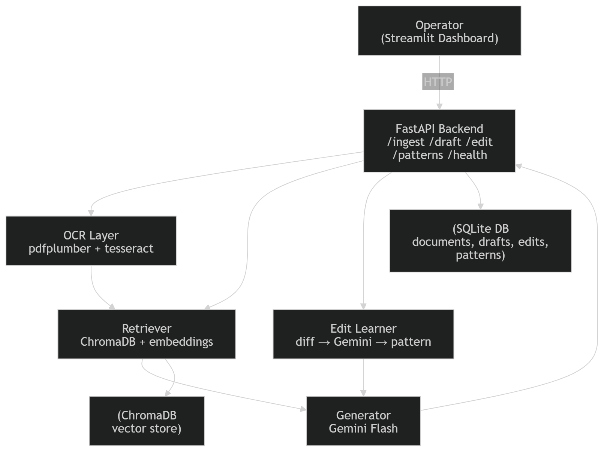

# ⚖️ Legal AI System — Pearson Specter Litt

An internal AI workflow that ingests messy legal documents, extracts structured information, retrieves grounded evidence, and generates legal drafts that improve over time through operator feedback.

---

## Table of Contents

1. [Architecture Overview](#architecture-overview)
2. [Prerequisites](#prerequisites)
3. [Virtual Environment Setup](#virtual-environment-setup)
4. [Environment Variables](#environment-variables)
5. [Running Locally](#running-locally)
6. [Running Tests](#running-tests)
7. [Docker Deployment](#docker-deployment)
8. [API Reference](#api-reference)
9. [System Walkthrough](#system-walkthrough)
10. [Assumptions & Tradeoffs](#assumptions--tradeoffs)
11. [Troubleshooting](#troubleshooting)

---

## Architecture Overview



### Component Summary

| Component      | File                        | Role                                              |
| -------------- | --------------------------- | ------------------------------------------------- |
| OCR/Extraction | `backend/ocr.py`            | pdfplumber → tesseract fallback → unstructured    |
| Parser         | `backend/parser.py`         | Regex extraction of dates, parties, clauses, type |
| Chunker        | `backend/chunker.py`        | Sliding window sentence-aware chunking            |
| Embeddings     | `backend/embeddings.py`     | sentence-transformers + ChromaDB                  |
| Retriever      | `backend/retriever.py`      | Cosine similarity retrieval with score filtering  |
| Grounding      | `backend/grounding.py`      | Evidence formatting + grounded prompt assembly    |
| Generator      | `backend/generator.py`      | Gemini Flash grounded draft generation            |
| Edit Learner   | `backend/edit_learner.py`   | Diff analysis → pattern extraction → SQLite       |
| Database       | `backend/db.py`             | SQLite persistence for all entities               |
| API            | `backend/app.py`            | FastAPI REST endpoints                            |
| Frontend       | `frontend/streamlit_app.py` | Dark-mode operator dashboard                      |

---

## Prerequisites

Install these before anything else:

### 1. Python 3.12

```bash
python --version   # must be 3.12.x
```

### 2. Tesseract OCR

```bash
# macOS
brew install tesseract

# Ubuntu / Debian
sudo apt-get install -y tesseract-ocr tesseract-ocr-eng

# Windows: Download installer from
# https://github.com/UB-Mannheim/tesseract/wiki
# Then add the install path to your PATH
```

### 3. Poppler (PDF → image conversion)

```bash
# macOS
brew install poppler

# Ubuntu / Debian
sudo apt-get install -y poppler-utils

# Windows: Download from https://github.com/oschwartz10612/poppler-windows
```

### 4. A Gemini API Key

Get one free at: https://aistudio.google.com/app/apikey

---

## Virtual Environment Setup

Run these commands from the **project root** directory (where `requirements.txt` lives):

```bash
# 1. Create virtual environment
py -3.12 -m venv venv

# 2. Activate it
# macOS / Linux:
source venv/bin/activate
# Windows (PowerShell):
venv\Scripts\activate

# 3. check python version (optional)
python --version

# You should now see (venv) in your terminal prompt along with the correct python version

# 3. Upgrade pip
python -m pip install --upgrade pip

# 4. Install all dependencies
python -m pip install -r requirements.txt

# Expected output (last lines):
# Successfully installed fastapi-0.111.0 uvicorn-0.30.1 ...
# (takes 2–5 minutes, downloads embedding model weights on first run)
```

---

## Environment Variables

```bash
# 1. Copy the example file
cp .env.example .env

# 2. Open .env and set your Gemini API key
# macOS/Linux:
nano .env
# or: code .env

# Set this line:
# GEMINI_API_KEY=your_actual_key_here
```

All other values have sensible defaults and do not need to be changed for local development.

---

## Running Locally

You need **two terminal windows** — one for the backend, one for the frontend.

### Terminal 1 — FastAPI Backend

```bash
# Activate venv first
source venv/bin/activate

# Start the API server
uvicorn backend.app:app --host 0.0.0.0 --port 8000 --reload

# Expected output:
# INFO:     Started server process [12345]
# INFO:     Waiting for application startup.
# INFO:     Legal AI System is running.
# INFO:     Application startup complete.
# INFO:     Uvicorn running on http://0.0.0.0:8000
```

Open http://localhost:8000/docs to see the interactive API documentation.

### Terminal 2 — Streamlit Frontend

```bash
# Activate venv in the second terminal
source venv/bin/activate

# Start the dashboard
streamlit run frontend/streamlit_app.py

# Expected output:
# You can now view your Streamlit app in your browser.
# Local URL: http://localhost:8501
```

Open http://localhost:8501 to use the dashboard.

---

## Running Tests

```bash
# Activate venv
source venv/bin/activate

# Run all tests with verbose output
pytest tests/ -v

# Run a specific test file
pytest tests/test_parser.py -v

# Run with coverage report
pip install pytest-cov
pytest tests/ -v --cov=backend --cov-report=term-missing

# Expected passing tests:
# test_ocr.py        ~10 tests
# test_parser.py     ~15 tests
# test_retriever.py  ~7 tests
# test_generator.py  ~5 tests
# test_edit_learner.py ~8 tests
```

---

## Docker Deployment

### Build and start all services

```bash
# From the project root
docker compose -f docker/docker-compose.yml build --no-cache
docker compose -f docker/docker-compose.yml up

# Expected output:
# [+] Building ... Successfully built
# [+] Running 2/2
# ✔ Container legal_ai_api       Healthy
# ✔ Container legal_ai_frontend  Started
```

- API: http://localhost:8000
- Dashboard: http://localhost:8501
- API Docs: http://localhost:8000/docs

### Stop services

```bash
docker-compose down          # stop and remove containers
docker-compose down -v       # also remove persistent data volumes
```

### Rebuild after code changes

```bash
docker-compose up --build --force-recreate
```

---

## API Reference

| Method   | Endpoint          | Description                              |
| -------- | ----------------- | ---------------------------------------- |
| `GET`    | `/health`         | System health status                     |
| `POST`   | `/ingest`         | Upload a document (multipart/form-data)  |
| `GET`    | `/documents`      | List all documents                       |
| `GET`    | `/documents/{id}` | Get document metadata                    |
| `DELETE` | `/documents/{id}` | Delete a document                        |
| `POST`   | `/draft`          | Generate a grounded draft                |
| `GET`    | `/drafts`         | List all drafts                          |
| `GET`    | `/drafts/{id}`    | Get a specific draft                     |
| `POST`   | `/edit`           | Submit operator edit (triggers learning) |
| `GET`    | `/patterns`       | List learned editing patterns            |
| `GET`    | `/edits`          | List recent operator edits               |

### Example: Ingest a document

```bash
curl -X POST http://localhost:8000/ingest \
  -F "file=@/path/to/contract.pdf"
```

### Example: Generate a draft

```bash
curl -X POST http://localhost:8000/draft \
  -H "Content-Type: application/json" \
  -d '{
    "doc_ids": ["<doc_id from ingest>"],
    "query": "Summarize the key facts of this case.",
    "draft_type": "case_fact_summary"
  }'
```

### Example: Submit an edit

```bash
curl -X POST http://localhost:8000/edit \
  -H "Content-Type: application/json" \
  -d '{
    "draft_id": "<draft_id>",
    "original_content": "Original draft text...",
    "edited_content": "Revised draft with bullet points...",
    "operator_notes": "Changed to bullet format for readability."
  }'
```

---

## System Walkthrough

### Step 1: Upload a Document

1. Open the dashboard at http://localhost:8501
2. Click **📂 Documents**
3. Drag and drop a PDF or image
4. Click **🚀 Ingest Document**
5. The system runs OCR → parsing → chunking → indexing automatically

### Step 2: Generate a Draft

1. Click **✍️ Generate Draft**
2. Select the ingested document(s)
3. Choose a draft type (Case Fact Summary, Internal Memo, etc.)
4. Edit the drafting instruction if desired
5. Click **⚡ Generate Draft**
6. The draft appears with evidence citations on the right

### Step 3: Review and Edit

1. Read the generated draft in the left panel
2. Check the source evidence in the right panel
3. Click **🔄 Edit & Learn**
4. Your edited version is pre-filled from the last draft
5. Make changes in the **Your Edited Version** panel
6. Click **📤 Submit Edit & Learn**

### Step 4: Improved Future Drafts

The system extracts a generalizable instruction from your edits (via Gemini) and stores it as a pattern. All future drafts of the same type automatically include these instructions. You can view all learned patterns under **🧠 Learned Patterns**.

---

## Assumptions & Tradeoffs

### Assumptions

- **OCR quality**: pdfplumber handles digitally-born PDFs well. For scans, tesseract accuracy depends on scan quality (300 DPI or higher recommended).
- **Gemini API**: Gemini Flash is used for both draft generation and pattern extraction. A valid API key is required.
- **Document types**: The classifier uses keyword heuristics. Complex documents may classify as "unknown" — this does not affect functionality.
- **Operator edits**: The system assumes honest edits that reflect genuine preferences, not adversarial inputs.

### Tradeoffs

- **Local embeddings vs. API embeddings**: We use `all-MiniLM-L6-v2` locally to avoid embedding API costs and latency. It is fast and good enough for retrieval; a more powerful model would improve recall at higher cost.
- **SQLite vs. PostgreSQL**: SQLite is sufficient for single-operator local use. For multi-user production, swap to PostgreSQL with minimal code changes in `db.py`.
- **ChromaDB local vs. managed**: ChromaDB PersistentClient is used. For production, consider ChromaDB Cloud or Pinecone.
- **Diff-based learning**: Extracting patterns from diffs is a practical approximation. A full preference-learning system would require more training signal.
- **Chunk size (800 chars)**: Balances embedding quality vs. context density. Legal documents often have long sentences — smaller chunks may lose context; larger ones may overwhelm the embedding model.

---

## Evaluation Coverage

| Rubric Area                     | Implementation                                                                                                                               |
| ------------------------------- | -------------------------------------------------------------------------------------------------------------------------------------------- |
| Document Processing (25 pts)    | `ocr.py`: pdfplumber → tesseract fallback → unstructured; `parser.py`: regex field extraction; `chunker.py`: sliding-window chunking         |
| Retrieval & Grounding (25 pts)  | `embeddings.py` + ChromaDB; `retriever.py` with cosine similarity; `grounding.py` formats evidence block with `[N]` citations in every draft |
| Draft Quality (10 pts)          | `generator.py` + `grounding.py`; 5 draft types; grounding-enforced prompt prevents hallucination                                             |
| Improvement from Edits (25 pts) | `edit_learner.py`: diff → Gemini pattern extraction → SQLite → auto-injected into future prompts                                             |
| Code Quality (10 pts)           | Modular backend; Pydantic schemas; structured logging; full error handling                                                                   |
| Documentation (5 pts)           | This README + `docs/architecture.png` + inline docstrings                                                                                    |

---

## Troubleshooting

### "GEMINI_API_KEY is not set"

```bash
# Make sure .env has your key
cat .env | grep GEMINI_API_KEY

# Or export directly:
export GEMINI_API_KEY=your_key_here
```

### "Cannot connect to the backend"

```bash
# Check the API is running
curl http://localhost:8000/health

# If not, start it:
uvicorn backend.app:app --port 8000
```

### "Tesseract not found"

```bash
# Check tesseract is installed and on PATH
tesseract --version

# macOS: brew install tesseract
# Ubuntu: sudo apt-get install tesseract-ocr
```

### "No module named 'backend'"

```bash
# Always run from the project root, not from inside backend/
cd /path/to/legal-ai-system
python -m uvicorn backend.app:app
# or:
PYTHONPATH=. uvicorn backend.app:app
```

### ChromaDB error on startup

```bash
# Delete the ChromaDB directory and let it recreate
rm -rf data/chroma_db
uvicorn backend.app:app
```

### Tests fail with import errors

```bash
# Ensure you are running pytest from the project root
cd /path/to/legal-ai-system
pytest tests/ -v
# NOT from inside the tests/ folder
```

### Docker: "port already in use"

```bash
# Kill whatever is using port 8000
lsof -ti:8000 | xargs kill -9
lsof -ti:8501 | xargs kill -9
docker-compose up
```

---
